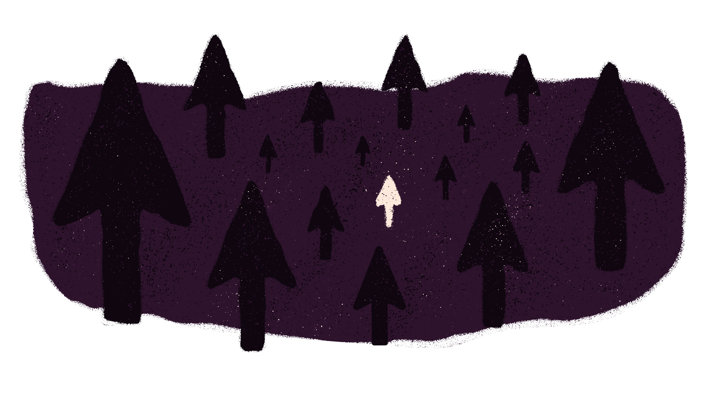

<section>

# In the dark and hitting trees

---

Wouldn’t it be terrible sitting in the woods at night without a lamp or fire to see anything? Imagine trying to use the Internet without visuals. It would be very hard to use.  Almost next to impossible. There’s a solution though and those are screen readers and tools to accept voice input to control the computer.

As you’ve seen so far through the vision manual a strong focus on content, image alt tags, and adding the extra aria attributes to our markup. Well guess what?! You’ve already learned about most of the tools to make a site accessible and screen readers happy. In turn that makes your users happy. Get to it! We'll have some examples here shortly, but practicing yourself will make your knowledge grow exponentially.

</section>

<section>

Try some of them out. Go to a website you’ve never been to, a social media site, or even a site you’ve developed. Close your eyes and see if you can navigate using the keyboard and a screen reader. You’ll be surprised at how much harder it is easier to use if a good job was done or how easy it is if a good job was done.

</section>

<section>

#### Here are some links to popular screen readers:

    

        <ul class="flex-grid--gutters flex-wrap">
            <li class="col--width__four link--list-item">
                

                    <h5><a href="http://www.chromevox.com/" target="_blank">ChromeVox</a></h5>
                

            </li>
            <li class="col--width__four link--list-item">
                

                    <h5><a href="https://www.apple.com/accessibility/mac/vision/" target="_blank">Mac Voice over</a></h5>
                

            </li>
            <li class="col--width__four link--list-item">
                

                    <h5><a href="https://www.nvaccess.org/" target="_blank">NV Access</a></h5>
                

            </li>
            <li class="col--width__four link--list-item">
                

                    <h5><a href="http://www.freedomscientific.com/Products/Blindness/JAWS" target="_blank">JAWS Screen reader</a></h5>
                

            </li>
            <li class="col--width__four link--list-item">
                

                    <h5><a href="http://www.gwmicro.com/Window-Eyes/" target="_blank">Window-Eyes Pro.</a></h5>
                

            </li>
            <li class="col--width__four link--list-item">
                

                    <h5><a href="http://mielke.cc/brltty/" target="_blank">BRLTTY</a></h5>
                

            </li>
        </ul>
    

</section>

<section>

#### Here are some links to popular dictation software:

    

        <ul class="flex-grid--gutters flex-wrap">
            <li class="col--width__four link--list-item">
                

                    <h5><a href="https://www.nuance.com/mobile/mobile-applications/dragon-dictation.html" target="_blank">Dragon Dictation App</a></h5>
                

            </li>
            <li class="col--width__four link--list-item">
                

                    <h5><a href="http://ttsreader.com" target="_blank">ttsreader.com</a></h5>
                

            </li>
            <li class="col--width__four link--list-item">
                

                    <h5><a href="https://www.naturalreaders.com/index.html" target="_blank">naturalreaders.com</a></h5>
                

            </li>
            <li class="col--width__four link--list-item">
                

                    <h5><a href="https://dictation.io/" target="_blank">dictation.io</a></h5>
                

            </li>
            <li class="col--width__four link--list-item">
                

                    <h5><a href="http://www.nch.com.au/express/index.html" target="_blank">Express Dictate</a></h5>
                

            </li>
            <li class="col--width__four link--list-item">
                

                    <h5><a href="https://support.apple.com/en-us/HT202584" target="_blank">Apple Dictation</a></h5>
                

            </li>
        </ul>
    

</section>

<section>

### Scout Review

* Practice your ARIA tags
* Test, test, and test with different screen readers to see if you can get around the site and that the tab order is working correctly. Make sure you content makes sense when read  out loud
* Make sure your form inputs can handle dictation software and when errors occur that the user can understand what  went wrong

</section>

<section class="section--badge-cta section--badge-cta__yellow mt--90">
    

        

            

                

                    
                

            

            

                <h3>Way to go! Nice badge scout.</h3>
                <h4>Beep. Boop. Reading text to a user so they are able to get around sites.</h4>
                
                    Previous: <a href="{{ page.prevSibling.url }}">{{ page.prevSibling.title }} &raquo;</a>
                
                
                    Up next: <a href="{{ page.nextSibling.url }}">{{ page.nextSibling.title }} &raquo;</a>
                
            

        

    

</section>
