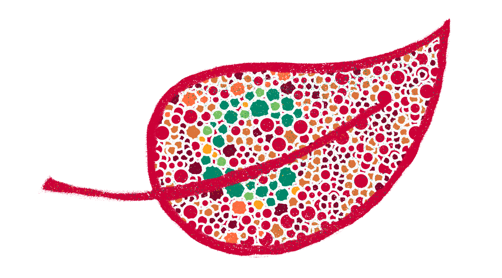
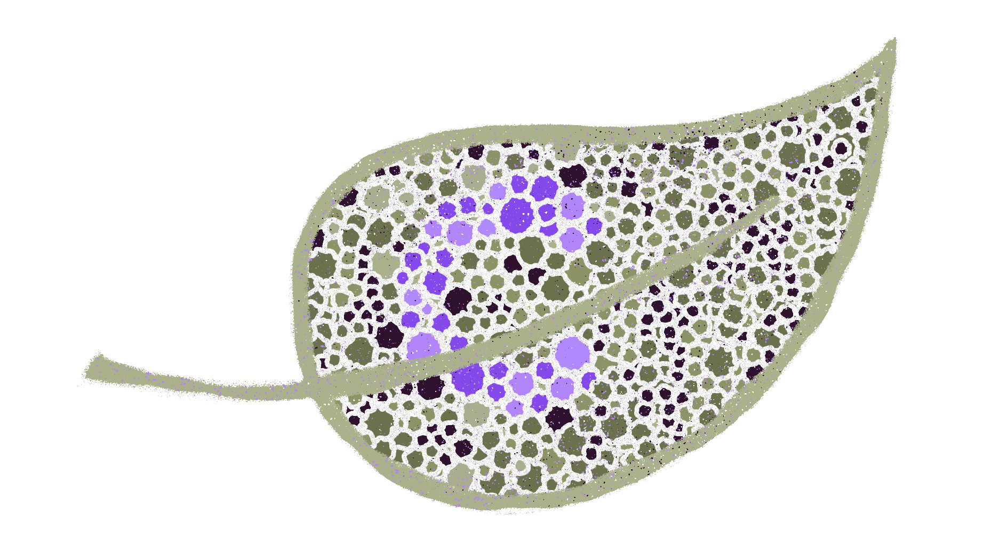
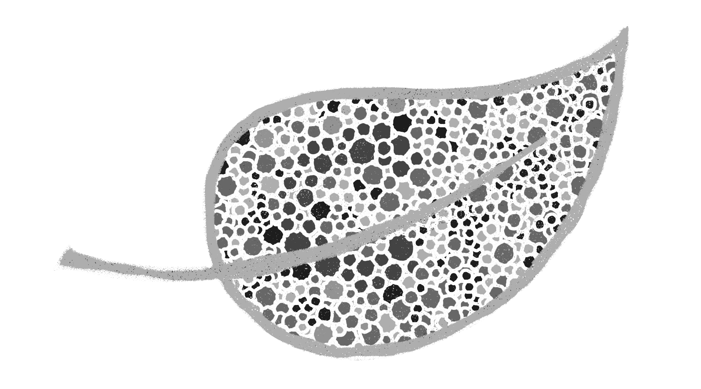

<section>

# Leaf one and two look exactly the same

---

The colors you choose matter. 1 in 200 women and 1 in 12 men are color blind. This gets even trickier with the the different types of color blindness. Let’s take a peak at the different types. Keep in mind this phenomena really only affects men the most, so pardon the frequent references to “males.”

</section>

<section>

#### Red-Green color blindness

Go ahead and read about all of the types, but the upshot is, reds, yellows, oranges, and greens end up appearing as various shades of yellow. Reds may appear as black. Violets and blues tend to look similar. Perhaps reds end up looking as brownish-yellow and greens as beige. All this depends on the specific type of red-green color blindness the user has. *Know your audience.*

* *Protanomaly*: In males with protanomaly, the red cone photopigment is abnormal. Red, orange, and yellow appear greener and colors are not as bright. This condition is mild and doesn’t usually interfere with daily living. Protanomaly is an X-linked disorder estimated to affect 1 percent of males.
* *Protanopia*: In males with protanopia, there are no working red cone cells. Red appears as black. Certain shades of orange, yellow, and green all appear as yellow. Protanopia is an X-linked disorder that is estimated to affect 1 percent of males.
* *Deuteranomaly*: In males with deuteranomaly, the green cone photopigment is abnormal. Yellow and green appear redder and it is difficult to tell violet from blue. This condition is mild and doesn’t interfere with daily living. Deuteranomaly is the most common form of color blindness and is an X-linked disorder affecting 5 percent of males.
* *Deuteranopia*: In males with deuteranopia, there are no working green cone cells. They tend to see reds as brownish-yellow and greens as beige. Deuteranopia is an X-linked disorder that affects about 1 percent of males.

Scientific content adapted for this project from: [Facts About Color Blindness | National Eye Institute](https://nei.nih.gov/health/color_blindness/facts_about)

</section>

<section>

#### Blue-Yellow color blindness

Again, please read the details but the summary is blues tend to appear greener and it can be a bit harder to tell yellow and red from pink. The user may also have trouble with yellow appearing violet or light grey.

* *Tritanomaly*: People with tritanomaly have functionally limited blue cone cells. Blue appears greener and it can be difficult to tell yellow and red from pink. Tritanomaly is extremely rare. It is an autosomal dominant disorder affecting males and females equally.
* *Tritanopia:* People with tritanopia, also known as blue-yellow color blindness, lack blue cone cells. Blue appears green and yellow appears violet or light grey. Tritanopia is an extremely rare autosomal recessive disorder affecting males and females equally.

Scientific content adapted for this project from: [Facts About Color Blindness | National Eye Institute](https://nei.nih.gov/health/color_blindness/facts_about)

</section>

<section>

#### Total color blindness

This condition is super rare but worth a mention. Color would be practically gone in this instance.

---

As a thought exercise, pull your mock up or a screenshot into your favorite image editing program and turn it to grayscale. Is it still communicating what you want it to? If not, figure out why not and adjust from there.

---

* *Cone monochromacy*: This rare form of color blindness results from a failure of two of the three cone cell photopigments to work. There is red cone monochromacy, green cone monochromacy, and blue cone monochromacy. People with cone monochromacy have trouble distinguishing colors because the brain needs to compare the signals from different types of cones in order to see color. When only one type of cone works, this comparison isn’t possible. People with blue cone monochromacy, may also have reduced visual acuity, near-sightedness, and uncontrollable eye movements, a condition known as nystagmus. Cone monochromacy is an autosomal recessive disorder.
* *Rod monochromacy or achromatopsia*: This type of monochromacy is rare and is the most severe form of color blindness. It is present at birth. None of the cone cells have functional photopigments. Lacking all cone vision, people with rod monochromacy see the world in black, white, and gray. And since rods respond to dim light, people with rod monochromacy tend to be photophobic – very uncomfortable in bright environments. They also experience nystagmus. Rod monochromacy is an autosomal recessive disorder.

</section>

<section>

**KNOW YOUR AUDIENCE.** Howdy scouts! You’re probably going to see this box quite often. The camp stresses the importance of accessibility and it comes down to the audience. A website for women’s underwear, *probably* doesn’t need to worry so much about color blindness for men (since it affects them the most.) A site for camping gear, yeah, probably needs way more consideration when it comes to those with color blindness.

</section>

<section>

Thankfully nerds on the Internet have built some tools around color blindness. You can find these other scout survival tools here:

</section>

<section>

<ul class="flex-grid--gutters flex-wrap">
    <li class="col--width__four link--list-item">
        

            <h5><a href="https://www.toptal.com/designers/colorfilter/" target="_blank">Toptal Color Blind Filter</a></h5>
        

    </li>
    <li class="col--width__four link--list-item">
        

            <h5><a href="http://enchroma.com/test/instructions/" target="_blank">Enchroma: Color Blindness Test</a></h5>
        

    </li>
    <li class="col--width__four link--list-item">
        

            <h5><a href="http://www.color-blindness.com/coblis-color-blindness-simulator/" target="_blank">Color Blindness Simulator</a></h5>
        

    </li>
<ul>

</section>

<section>

### Scout Review

* Know your audience! If your user base is going to be mostly males, please adjust and test color palettes accordingly.
* Test, test, and test!
* Try to avoid certain tints/shades of the same color together. That’s sometimes hard for non-color blind people to see
* If using a color that those who are color blind can’t really see, make sure there’s a enough difference between them to make sure the colors are still distinct to their vision.

</section>

<section class="section--badge-cta section--badge-cta__red mt--90">
    

        

            

                

                    
                

            

            

                <h3>Way to go! Nice badge scout.</h3>
                <h4>Great! Color blindness is a major aspect to keep in mind when creating a site.</h4>
                
                    Previous: <a href="{{ page.prevSibling.url }}">{{ page.prevSibling.title }} &raquo;</a>
                
                
                    Up next: <a href="{{ page.nextSibling.url }}">{{ page.nextSibling.title }} &raquo;</a>
                
            

        

    

</section>
