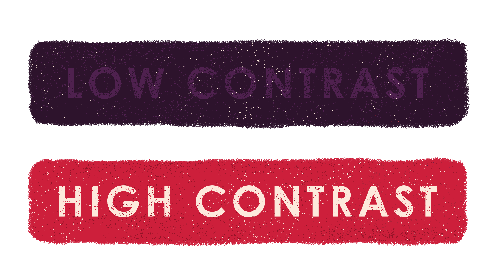

<section>

<h1>Seeing the forest through the trees</h1>

Imagine a world without color. It’d be a bit hard to tell the difference between things. Imagine a world were one has trouble differentiating colors. Image a world were you can’t see the same colors as others. These are all real possibilities.

</section>

<section>

The ARIA spec has two levels of contrast ratios that text on a background should meet. The body text you are reading as you read is 7:1:1. A very high contrast ratio and meets the level three spec. Pretty dang good and pretty dang accessible.

</section>

<section>

</section>

<section>

#### WAIT CAMP COUNSELOR! WHAT THE HECK IS THE ARIA SPEC?!

We'll get into some of the attributes that can be added to your mark up (another chapter in your manual). In short, it's a specification that has been developed to standardized the way accessibility is handled by browsers and developers on the web. It gives us a way to 1) use native elements in the browser and have them work out of the box in the browser (if the browser supports ARIA.) and 2) allows developers to add these extra attributes to a site to extend the features that they are building to be accessible and be able to be parsed and understood through assistive technology.

There's also general rules and limits for color contrast, type sizes, and design best practices.

</section>

<section>

Whew! Glad we got that covered. Anyways, color contrast is a simple idea. If it’s hard to read for a user without an impairment, put yourself in someone else’s shoes. Yeah, light gray text on a white background softens the look and sometimes looks dope. BUT IT’S HARD TO READ, SILLY. At the end of the day, our job is disseminate information in the best way possible and engage the user.

</section>

<section>

**KNOW YOUR AUDIENCE.** If you are designing for 55+: color contrast and legibility of colors on top of one another became a big freakin’ deal. If you are designing for a younger audience, it doesn’t matter as much, BUT still be mindful that anyone, at anytime, can access your designed content and should still be accessible to the greatest amount of people.

</section>

<section>

### Scout Review

* Test your color palette!
* If it’s hard for you to read, it’s hard for others to read.
* You can get away with low contrast in non-essential text, but long blocks of text and navigation should be highly visible to all users.
* Test and refine!
* Ask others how your color palette is working and if the contrast between type, color, illustration, and content is working.
* Don’t use this as a crutch to stick to one color palette that works, explore, explore, and explore. The spec is flexible, just be mindful.

</section>

<section class="section--badge-cta section--badge-cta__red mt--90">
    

        

            

                

                    
                

            

            

                <h3>Way to go! Nice badge scout.</h3>
                <h4>Color, color, color, color, color, color contrast! Do dah do dah. (A song, we hope.)</h4>
                
                    Previous: <a href="{{ page.prevSibling.url }}">{{ page.prevSibling.title }} &raquo;</a>
                
                
                    Up next: <a href="{{ page.nextSibling.url }}">{{ page.nextSibling.title }} &raquo;</a>
                
            

        

    

</section>
