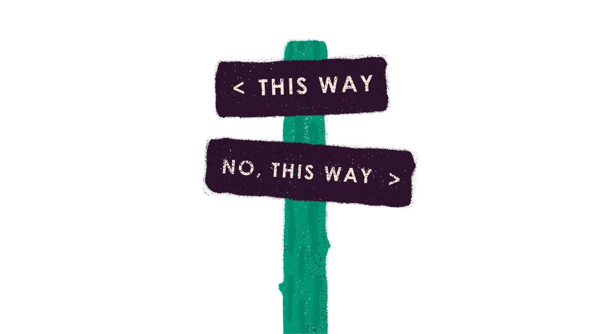

<section>

# A primer on trail signs

---

Way finding lives and dies by good typography and iconography. Here we are going to focus on typography. Way finding on the net ends up being navigation, but in reality the important parts of an experience is driven by typography. Color and typography are some of the most important things to keep a site accessible. (Next to screen readers of course but we will get there.)

</section>

<section>

### The design of trail signs

Wait?! You mean I have to design a trail sign to make the web accessible?! No, scout. Just an analogy. Really, it’s what’s on the sign that we are concerned about.

</section>

<section>

#### Pay attention to the details

Typefaces are a dime a dozen nowadays—we don’t mean that in a bad way, we love typography! There’s so many different designs, classifications, and wacky fonts out there in the wild. Typography is an art and knowing what anatomy to look out for when keeping a design accessible is important. The typography for this site was selected for it’s language features and the actual design of it to provide a more pleasurable reading experience. If the typeface is really hard to read, probably not all that accessible.

Some features of a type face to consider:

* Readability vs. legibility
	* Can you tell what the words are and be able to read comfortably?
* Langauge support
	* Does it support more than just english? What does the font software do if the glyph it needs isn’t present?
* Sans serif vs. serif
	* Are the letter forms distinct?
* The design of the typeface
	* Are the letters too condensed?
	* Are the serifs apparent?
	* What about the tails? Are they distinct or do they blend  in together?
	* How are the counters working in the letter forms?
	* Stroke weight aiding in the readability?
	* Proportions good? Larger x-height and wider letters are most accessible.

</section>

<section>

### Creating the trail signs
The size and color one uses can ruin a well designed typeface. Here are some dos and don’ts to keep in mind when making typography accessible. (Guess what?! **Know your audience.**)

##### DO:
* Give generous line height (but not too generous)
* Provide good hierarchy
* If pairing, make sure there’s contrast in the design of  the typefaces
* If using color, make sure your most important areas have the most contrast
* Have fallbacks fonts in case the rendering of one doesn’t work
* Keep line lengths shorter than you think (70–80 characters) or about 16 words.
* Keep font sizes above 16px to be more inclusive
* Keep in mind how far one tends to sit away from a device, not normally as personal as a book

##### DON’T:
* Put light text on a light background—especially for body text
* Use two san-serifs or serifs together that look exactly the same when trying to create hierarchy
* Make things people need to do look subtle
* Make type too small
* Set type below 16px (though you can get away with 14px but that’s pushing it, scout!)
* Use fonts with think stroke weights or too thick stroke weights
	* These end up being to thin to read or too thick and the counters fill in at smaller sizes

</section>

<section>

### Scout Review

* Know your audience!
* Review the typeface design, critique it, test it out, make sure it works the way it should
* Make your type hierarchy as clear as possible
* Review the dos and don’ts of the use of typography
* Can’t stress enough trying and refining things

</section>

<section class="section--badge-cta section--badge-cta__red mt--90 pb--60">
    

        

            

                

                    
                

            

            

                <h3>Way to go! Nice badge scout.</h3>
                <h4>Type is freakin' wonderful, isn't it!</h4>
                
                    Previous: <a href="{{ page.prevSibling.url }}">{{ page.prevSibling.title }} &raquo;</a>
                
                
                    Up next: <a href="{{ page.nextSibling.url }}">{{ page.nextSibling.title }} &raquo;</a>
                
            

        

    

</section>
